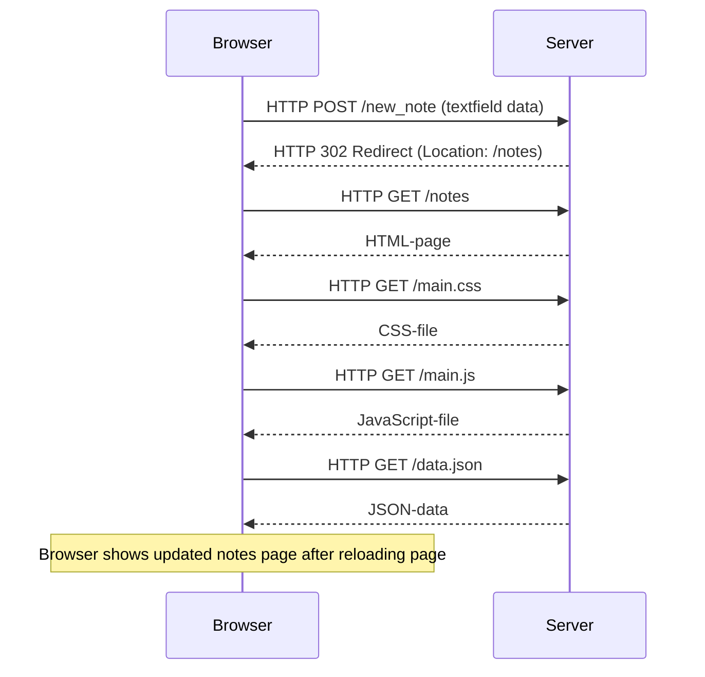

```mermaid
sequenceDiagram
    participant Browser
    participant Server

    Browser->>Server: HTTP POST /new_note (textfield data)
    Server-->>Browser: HTTP 302 Redirect (Location: /notes)
    Browser->>Server: HTTP GET /notes
    Server-->>Browser: HTML-page
    Browser->>Server: HTTP GET /main.css
    Server-->>Browser: CSS-file
    Browser->>Server: HTTP GET /main.js
    Server-->>Browser: JavaScript-file
    Browser->>Server: HTTP GET /data.json
    Server-->>Browser: JSON-data

    Note over Browser: Browser shows updated notes page after reloading page
```